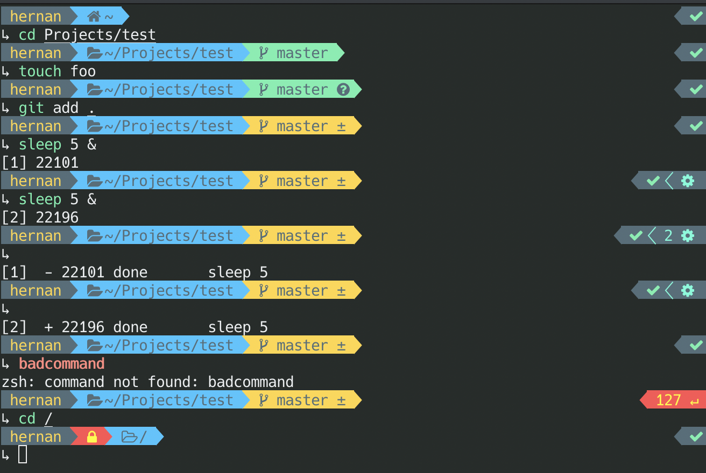

# Set up

1. Install [Zsh](https://www.zsh.org/) `brew install zsh`
2. Install [Oh-My-ZSH](https://github.com/robbyrussell/oh-my-zsh) by `sh -c "$(curl -fsSL https://raw.githubusercontent.com/robbyrussell/oh-my-zsh/master/tools/install.sh)"`
3. Install theme and fonts
   * `brew tap sambadevi/powerlevel9k`
   * `brew install powerlevel9k`
   * `brew tap caskroom/fonts`
   * `brew cask install font-hack-nerd-font`
4.  Install plugins
    * [zsh-autosuggestions](https://github.com/zsh-users/zsh-autosuggestions) by `git clone https://github.com/zsh-users/zsh-autosuggestions.git $ZSH_CUSTOM/plugins/zsh-autosuggestions`
    * [zsh-syntax-highlighting](https://github.com/zsh-users/zsh-autosuggestions) by `git clone https://github.com/zsh-users/zsh-syntax-highlighting.git $ZSH_CUSTOM/plugins/zsh-syntax-highlighting`
5. Import **iTerm** profile `iterm-profile.json` to set color schema and fonts
6. MacOS Finder setup
   - `defaults write com.apple.finder AppleShowAllFiles YES`
   - `defaults write com.apple.finder ShowPathbar -bool true`
   - `defaults write com.apple.finder ShowStatusBar -bool true`
